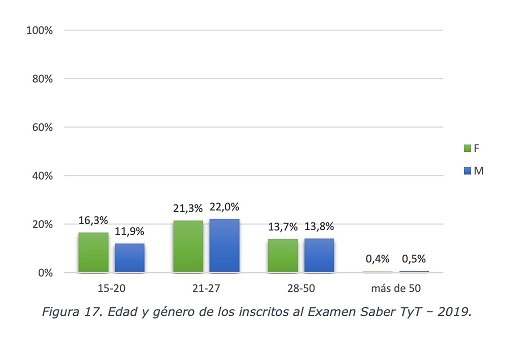

```{r global_options, echo=FALSE}
knitr::opts_chunk$set(fig.path="", message=FALSE, warning=FALSE,
                      echo=FALSE, results="show", fig.width=11)
```
# Contexto 


## El presente informe
Este es un informe de análisis de resultados del Examen Saber TyT, realizado por el departamento de estadísticas e información institucional de la Institución Educando Líderes, con el cual ofrecemos un panorama general del desempeño del país en el segundo periodo de 2016, desde la perspectiva de nuestra institución.

El informe está dirigido a la comunidad académica de interés tanto en lo concerniente a las conclusiones cómo a las diferentes etapas del proceso de análisis sobre los datos.

La primera etapa del proceso, cubierta en esa edición del informe, consiste en el aseguramiento de la calidad de los datos y, en consecuencia, de la adecuada preparación de los mismos a fin de suministrar un adecuado set de datos para que el análisis de los resultados pueda llevarse a cabo en una segunda etapa. 


## El examen {.tabset .tabset-fade .tabset-pills}

El pasado 9 de septiembre de 2016, el Icfes realizó el Examen de Estado de la Calidad de la Educación Superior, Saber TyT.  
De acuerdo con la página oficial  (_[link](https://www.icfes.gov.co/web/guest/acerca-del-examen-saber-tyt)_), la prueba está dirigida a la siguiente población:

### Estudiantes de últimos semestres de programas académicos Técnicos y Tecnológicos
La prueba está dirigida a estudiantes que han aprobado el 75% de los créditos de sus respectivos programas técnicos profesionales y tecnológicos.

### Población en condición de discapacidad

La prueba aplica para población con las siguientes discapacidades:

|Tipo de discapacidad                               |
|---------------------------------------------------|-
|Discapacidad física - movilidad                    |
|Discapacidad auditiva - usuario del castellano     |
|Discapacidad visual - baja visión irreversible     |
|Discapacidad visual - ceguera                      |
|Sordoceguera                                       |
|Trastorno permanente de la voz y el habla          |
|Discapacidad intelectual                           |
|Discapacidad mental/psicosocial                    |
|Trastorno del espectro autista                     |
|Trastorno del espectro autista - asperger          |
|Discapacidad sistémica                             |

### Reclusos
La prueba aplica para población privada de la libertad, siendo esta presentada en su sitio de reclusión respectivo

### Etnias
Las siguientes son las categorías étnicas que han sido contempladas para la clasificación de los aplicantes a la prueba.

|Etnias                     |     -                     |
|---------------------------|---------------------------|
|Arhuaco                    |Pasto                      |
|Cancuamo                   |Pijao                      |
|Comunidad Afrodescendiente |Raizal o Palenquero        |
|Comunidad Rom (gitana)     |Sikuani                    |
|Cubeo                      |Tucano                     |
|Embera                     |Wayúu                      |
|Guambiano                  |Zenú                       |
|Huitoto                    |Ninguno                    |
|Inga                       |Otro                       |
|Paez                       |                           |


```{r Packages and functions, echo=FALSE, message=FALSE, warning=FALSE}
library(readxl)
library(reshape2)
library(dplyr)
library(e1071)
library(Hmisc)
library(inspectdf) #este no lo tienen
library(funModeling) #este no lo tienen
library(VIM) #este no lo tienen
library(stringr)
library(xtable) #este no lo tienen
library(ggplot2)
library(directlabels)
library(scales)
library(ggthemes)
library(mice)
library(BBmisc)
library(ggplot2)

descriptivas<- function(x){data.frame("MEDIDA"=c("Observaciones", "Mínimo", "1er Q", "Media", "Mediana", "Desv Est", "3er Q", "Máximo", "Asimetría", "Curtosis", "atípico leve<", "atípico leve>","atípico extremo<","atípico extremo>", "Err Est Media", "IC(95%) Media Up", "IC(95%) Media Down"),"VALOR"=format(c(length(na.omit(x)), min(na.omit(x)), quantile(na.omit(x), prob=0.25), mean(na.omit(x)), median(na.omit(x)), sd(na.omit(x)), quantile(na.omit(x), prob=0.75), max(na.omit(x)), skewness(na.omit(x)), kurtosis(na.omit(x)), (2.5*quantile(na.omit(x),prob=0.25)-1.5*quantile(na.omit(x), prob=0.75)),(2.5*quantile(na.omit(x),prob=0.75)-1.5*quantile(na.omit(x), prob=0.25)),(4*quantile(na.omit(x),prob=0.25)-3*quantile(na.omit(x), prob=0.75)),(4*quantile(na.omit(x),prob=0.75)-3*quantile(na.omit(x), prob=0.25)), ((sd(na.omit(x))/sqrt(length(na.omit(x))))), (mean(na.omit(x))+1.96*(sd(na.omit(x))/sqrt(length(na.omit(x))))), (mean(na.omit(x))-1.96*((sd(na.omit(x))/sqrt(length(na.omit(x))))))), scientific = F))}
#FUNCIÓN PARA ESTADÍSTICAS DESCRIPTIVAS PARA VARIABLES CONTINUAS

descriptivas2<-function(Continua,Categorias){
  x1=aggregate.data.frame(Continua, by=list(Categorias), FUN=function(x){length(na.omit(x))})
  names(x1)=c("Categoría","Obs")
  x2=aggregate.data.frame(Continua, by=list(Categorias), FUN=function(x){min(na.omit(x))})
  names(x2)=c("Categoría","Mínimo")
  x3=aggregate.data.frame(Continua, by=list(Categorias), FUN=function(x){quantile(na.omit(x), prob =0.25)})
  names(x3)=c("Categoría","1er Q")
  x4=aggregate.data.frame(Continua, by=list(Categorias), FUN=function(x){median(na.omit(x))})
  names(x4)=c("Categoría","Mediana")
  x5=aggregate.data.frame(Continua, by=list(Categorias), FUN=function(x){mean(na.omit(x))})
  names(x5)=c("Categoría","Media")
  x6=aggregate.data.frame(Continua, by=list(Categorias), FUN=function(x){quantile(na.omit(x), prob =0.75)})
  names(x6)=c("Categoría","3er Q")
  x7=aggregate.data.frame(Continua, by=list(Categorias), FUN=function(x){max(na.omit(x))})
  names(x7)=c("Categoría","Máximo")
  x8=aggregate.data.frame(Continua, by=list(Categorias), FUN=function(x){sd(na.omit(x))})
  names(x8)=c("Categoría","Desv Est")
  x9=aggregate.data.frame(Continua, by=list(Categorias), FUN=function(x){skewness(na.omit(x))})
  names(x9)=c("Categoría","Asimetría")
  x10=aggregate.data.frame(Continua, by=list(Categorias), FUN=function(x){kurtosis(na.omit(x))})
  names(x10)=c("Categoría","Curtosis")
  cbind(x1,x2,x3,x4,x5,x6,x7,x8,x9,x10)[,-seq(3,19,2)]
}
#FUNCIÓN PARA ESTADÍSTICAS DESCRIPTIVAS PARA VARIABLES CONTINUAS EN SUBMUESTRAS
  
tabla_freq<- function(x,total=1,na="ifany"){
  if (total==1) {
    M=data.frame("Categoria"=table(x, useNA = na), "Rel"=prop.table(table(x,useNA = na)))[,-3]
    names(M)=c("Categoria","Freq. Abs.","Freq. Rel.")
    M$Categoria=as.character(M$Categoria)
    M[nrow(M)+1,]=c("Total",sum(M$`Freq. Abs.`),sum(M$`Freq. Rel.`))
    M$`Freq. Rel.`=as.numeric(M$`Freq. Rel.`)
    M$`Freq. Abs.`=as.numeric(M$`Freq. Abs.`)
    M
  } else{
    M=data.frame("Categoria"=table(x, useNA = na), "Rel"=prop.table(table(x,useNA = na)))[,-3]
    names(M)=c("Categoria","Freq. Abs.","Freq. Rel.")
    M
  }
}
#FUNCIÓN PARA ESTADÍSTICAS DESCRIPTIVAS PARA VAR DISCRETAS

tabla_freq2<-function(x,y,na="ifany",prop=0, suma=c("filas","col")){
  if (prop==0) {
    M=as.data.frame.matrix(table(x, y, useNA = na))
    M$Categoria=row.names(M)
    rownames(M)=NULL
    M=M[,c(ncol(M),1:ncol(M)-1)]
    M$Categoria=as.character(M$Categoria)
    M[nrow(M)+1,]=c("Total",colSums(M[,2:ncol(M)]))
    M[,2:ncol(M)]=sapply(M[,2:ncol(M)], as.numeric)
    M$Total=rowSums(M[,2:ncol(M)])
    M
  } else if (prop==1 & suma=="filas") {
    M=as.data.frame.matrix(table(x, y, useNA = na))
    M$Categoria=row.names(M)
    rownames(M)=NULL
    M=M[,c(ncol(M),1:ncol(M)-1)]
    M$Categoria=as.character(M$Categoria)
    M[nrow(M)+1,]=c("Total",colSums(M[,2:ncol(M)]))
    M[,2:ncol(M)]=sapply(M[,2:ncol(M)], as.numeric)
    M$Total=rowSums(M[,2:ncol(M)])
    for (i in 2:ncol(M)) {
      M[,i]=M[,i]/M[,ncol(M)]
    }
    M
  } else {
    M=as.data.frame.matrix(table(x, y, useNA = na))
    M$Categoria=row.names(M)
    rownames(M)=NULL
    M=M[,c(ncol(M),1:ncol(M)-1)]
    M$Categoria=as.character(M$Categoria)
    M[nrow(M)+1,]=c("Total",colSums(M[,2:ncol(M)]))
    M[,2:ncol(M)]=sapply(M[,2:ncol(M)], as.numeric)
    M$Total=rowSums(M[,2:ncol(M)])
    for (i in 1:nrow(M)) {
      M[i,2:ncol(M)]=M[i,2:ncol(M)]/M[nrow(M),2:ncol(M)]
    }
    M 
  }
}
```

# Los datos 

## Base de datos (fuente original)

La base de datos sobre la cual realizaremos el análisis fue provista por el Icfes en formato CSV.  
Archivo: "SABERTYT20162.csv".  El diccionario de variables de esta base de datos puede ser consultado  [aqui](https://www.icfes.gov.co/documents/20143/1885820/2.+Genericas_SaberTyT_2016_2019.pdf).

```{r echo=FALSE}
setwd("./")
base= read.csv(file='SABERTYT20162.csv', encoding="latin1", header= TRUE, sep=';', na.strings = c("NA",""))
str(base)
```

## Identificación de la estructura de los datos para el análisis

Después de analizar la estructura de la base de datos, determinamos:

* De las 104 columnas disponibles,  las características que serán relevantes para este análisis corresponden con las columnas 1 a la 15 y las columnas 85 a 104.  
* Trabajar sobre los registros de resultados cuyo estado indica que son registros listos para publicar (ESTADO "PUBLICAR") 
* Analizar los registros correspondientes a los estudiantes de nacionalidad colombiana (PAIS COLOMBIA*).

La base de datos final sobre la cual realizar el análisis es:

```{r echo=FALSE}
base= base[,c(1:15,85:104)]
base= base[base$ESTU_ESTADO == "PUBLICAR",]
base= base[base$ESTU_NACIONALIDAD == "1 COLOMBIA",]
str(base)
```
> En la validación del dato de nacionalidad pudimos observar que se incluye tanto el código como el nombre del país en el mismo campo, sin embargo, no se observa inconsistencia alguna respecto a este dato, ya que los demás paises están almacenados de manera consistente bajo la estructura "código nombre". 

# Calidad de los datos {.tabset .tabset-fade .tabset-pills} 

Cómo parte del proceso, nos ocupamos de realizar algunos análisis particulares que compartimos a continuación. 

## Comprobación de anomalías {.tabset .tabset-fade .tabset-pills} 

### Prueba de niveles de inglés 

Los niveles de inglés, según el Icfes, son en orden ascendente de acuerdo con el nivel de desempeño:

1. A1- 
2. A1
3. A2
4. B1
5. B2 

En vista de que, según el Ministerio de Educación Nacional, una institución de educación superior tiene la meta de llevar a sus estudiantes a nivel B1 o B2, realizamos una revisión de los datos para identificar el volumen de estudiantes que cumplen o no con esta condición.

```{r nivel de ingles, echo=FALSE, message=FALSE}
base$MOD_INGLES_DESEM= factor(base$MOD_INGLES_DESEM, levels=c("A1-","A1","A2","B1","B2"))
### creamos una nueva Variable (meta_ingles_cumplida)
base$meta_ingles_cumplida = ifelse(base$MOD_INGLES_DESEM == "B1" | base$MOD_INGLES_DESEM == "B2", "SI", "NO")
base$meta_ingles_cumplida = factor(base$meta_ingles_cumplida)
table(base$MOD_INGLES_DESEM)
tabla_freq(base$meta_ingles_cumplida)
```
> Tabla de frecuencia cumplimiento nivel de inglés

Pudimos comprobar que el 13.98% efectivamente cumple con el nivel de inglés esperado.  *No se observan anomalías, a partir del caso.*

### Edad de los estudiantes 

Agregamos una variable relativa a la edad del estudiante al momento de presentar la prueba, a fin de realizar la caracterización.  

```{r echo=FALSE}
base$edad = round(as.numeric(difftime(as.Date("9/09/2016", format="%d/%m/%Y"),as.Date(base$ESTU_FECHANACIMIENTO, format="%d/%m/%Y"), units = "weeks"))/52.17857, digits = 2)
```

Producto de ello, encontramos algunas edades negativas o cero, que nos conducen a concluir una anomalía en las fechas de nacimiento de la base de datos:

```{r echo=FALSE}
### Revisar las fechas de nacimiento atípicas por cálculo negativo
tabla_freq(base$edad<=1)

```
> Tabla de frecuencia registros con edades negativas o cero



> Caracterización de referencia edades inscritos a las pruebas Saber TyT.

Adicionalmente, de acuerdo con el gráfico anterior, la prueba está caracterizada por el icfes para una población que supera los 15 años, lo cual nos hace suponer que los 22 registros (0,04%)  que indican edades menores a los 15 años, corresponden a anomalías que deben ser verificadas en la fuente y serán incluidas en nuestro informe final. 

```{r echo=FALSE}
rangos_edad = base[base$edad>=1, c("ESTU_FECHANACIMIENTO","edad")]
rangos_edad = rangos_edad[!is.na(rangos_edad$edad),]
rangos_edad$rango_edad = cut(rangos_edad$edad, breaks = c(0, 14.5, 21, 28, 50, 100))
rangos_edad$rango_edad = factor(rangos_edad$rango_edad)
tabla_freq(rangos_edad$rango_edad)
ggplot(rangos_edad, aes(x=rango_edad, y=(..count..)/sum(..count..)))+
  geom_bar(fill="steelblue", color="black")+
  labs(x="Rango Edad",y="Frecuencia")+
  scale_y_continuous(limits = c(0,0.5), breaks = seq(0,0.5,0.05), labels=percent)+
  geom_text(aes(label=percent((..count..)/sum(..count..))), stat='count',vjust=-0.5, fontface = "bold", size=3)+
  theme_base()

```

> Distribución de rangos de edades en la prueba

Estos 22 registros sumados a los 52 registros descartados por valores negativos o cero en el cálculo de la edad, representan tan solo el 0,14% de la muestra.

### Etnias

|Etnias                     |     -                     |
|---------------------------|---------------------------|
|Arhuaco                    |Pasto                      |
|Cancuamo                   |Pijao                      |
|Comunidad Afrodescendiente |Raizal o Palenquero        |
|Comunidad Rom (gitana)     |Sikuani                    |
|Cubeo                      |Tucano                     |
|Embera                     |Wayúu                      |
|Guambiano                  |Zenú                       |
|Huitoto                    |Ninguno                    |
|Inga                       |Otro                       |
|Paez                       |                           |

> Etnias, diccionario de datos de la variable. Fuente: portal del Icfes.

```{r echo=FALSE}
base$ESTU_ETNIA = factor(base$ESTU_ETNIA)

tabla_freq(base$ESTU_ETNIA)
```
> Etnias, ocurrencias en la base de datos del análisis

En primera instancia confirmamos que no observamos valores inválidos o sin referencia en el diccionario de datos de la variable. 

```{r echo=FALSE}
base$ESTU_TIENE_ETNIA = factor(base$ESTU_TIENE_ETNIA, levels=c("SI","NO"))
tabla_freq(base$ESTU_TIENE_ETNIA)
```
> Distribución de categorías con etnia

```{r echo=FALSE}
## base_etnias = base[!is.na(base$ESTU_TIENE_ETNIA), c("ESTU_TIENE_ETNIA", "ESTU_ETNIA")]
base_etnias = base[, c("ESTU_TIENE_ETNIA", "ESTU_ETNIA")]
base_etnias = base_etnias[order(base_etnias$ESTU_TIENE_ETNIA, base_etnias$ESTU_ETNIA), ]
table( base_etnias)
```
> Distribución de los registros de grupos étnicos

Observamos que los 3.276 registros clasificados con etnia SI, 3.010 contienen su respectivo registro de grupo étnico minoritario. 266 registros no lo tienen (NA), lo cual constituye  una anomalía que será incluida en el informe de correcciones requeridas.

Observamos que los 45.098 registros clasificados como que NO pertenecesn a un grupo étnico minoritario, 76 de ellos contienen un registro de grupo étnico, lo cuál es una inconsistencia que debe ser incluida en el informe de correcciones requeridas.

En total son 3.086 registros de pertenecientes a grupos étnicos minoritarios, que deberían corresponder con el número de registros clasificados de esa manera, de acuerdo con el diccionario de variables 2016-2 SABER TYT.

### Limitaciones

```{r echo=FALSE}
tabla_freq(base$ESTU_LIMITA_MOTRIZ)
```
> Distribución limitación motriz.

```{r echo=FALSE}
tabla_freq(base$ESTU_LIMITA_INVIDENTE)
```
> Distribución limitación Invidente.

```{r echo=FALSE}
tabla_freq(base$ESTU_LIMITA_CONDICIONESPECIAL)
```
> Distribución limitación por condición especial.

```{r echo=FALSE}
tabla_freq(base$ESTU_LIMITA_SORDO)
```
> Distribución limitación auditiva.

```{r echo=FALSE}
tabla_freq(base$ESTU_LIMITA_AUTISMO)
```
> Distribución limitación por autismo.

En todos los casos, observamos consistencia en los datos entregados, respecto a su definición en el diccionario de variables.


```{r echo=FALSE}
base_limitaciones = base[ , c("ESTU_LIMITA_CONDICIONESPECIAL","ESTU_LIMITA_SORDO","ESTU_LIMITA_INVIDENTE","ESTU_LIMITA_MOTRIZ", "ESTU_LIMITA_AUTISMO")] 
capture.output(aggr(base_limitaciones, numbers=TRUE, prop=FALSE, sortVars=TRUE, cex.axis = 0.7, cex.numbers = 0.7, labels=c("L_CNDESP","L_SORDO","L_INVID","L_MOTRIZ", "L_AUTISM")), file=tempfile())

```

> Se observa en este gráfico, las 78 combinaciones de discapacidad que presentaron según los datos.

En vista de que, de acuerdo con el diccionario de variables, si se inscribió indicando que tiene alguna discapacidad - Motriz, Invidente, Condición especial, Sordo o Autismo, ello Indica que se inscribió con discapacidad, entonces es conveniente disponer una variable que lo represente de esa manera.


```{r echo=FALSE}
base$tiene_discapacidad = ifelse((base$ESTU_LIMITA_CONDICIONESPECIAL=="x" & !is.na(base$ESTU_LIMITA_CONDICIONESPECIAL)) | (base$ESTU_LIMITA_SORDO=="x" & !is.na(base$ESTU_LIMITA_SORDO)) | (base$ESTU_LIMITA_INVIDENTE == "x" & !is.na(base$ESTU_LIMITA_INVIDENTE)) | (base$ESTU_LIMITA_MOTRIZ == "x" & !is.na(base$ESTU_LIMITA_MOTRIZ)) | (base$ESTU_LIMITA_AUTISMO=="x" & !is.na(base$ESTU_LIMITA_AUTISMO)), "SI", "NO")
tabla_freq(base$tiene_discapacidad)

```
> Distribución para el análisis de discapacidad.  

### Puntajes Pruebas

Los puntajes por modulos de la pruebas TyT tienen la siguiente definición segun el ICFES (_[link](https://www.icfes.gov.co/documents/20143/496194/Resultados%20que%20se%20reportan%20saber%20tyt%202018%201.pdf)_)


> Definición puntaje por módulo.  


```{r echo=FALSE}
base_puntaje= base[,c('MOD_RAZONA_CUANTITAT_PUNT','MOD_LECTURA_CRITICA_PUNT','MOD_COMPETEN_CIUDADA_PUNT','MOD_INGLES_PUNT','MOD_COMUNI_ESCRITA_PUNT')]
names(base_puntaje)[1]<- 'Razon_cuantitativa'
names(base_puntaje)[2]<- 'Lect_critica'
names(base_puntaje)[3]<- 'Compe_ciudadana'
names(base_puntaje)[4]<- 'Ingles'
names(base_puntaje)[5]<- 'Comu_escrita'

ggplot(data = stack(base_puntaje), aes(x = ind, y = values)) +
       stat_boxplot(geom = "errorbar", # Boxplot with error bars
                    width = 0.2) +
       geom_boxplot(fill = "#4271AE", colour = "#1F3552", # Colors
                    alpha = 0.9, outlier.colour = "red") +
       scale_y_continuous(name = "Puntaje") +  # Continuous variable label
       scale_x_discrete(name = "Modulo") +      # Group label
       ggtitle("Puntaje por modulo Prueba TyT") + # Plot title
       theme(axis.line = element_line(colour = "black", # Theme customization
                                      size = 0.25))
```

> Diagrama de cajas del puntaje por modulo en la prueba TyT.  

Podemos notar en los gráficos de cajas que los promedios de cada uno de los módulos de la prueba son parecidos. A pesar de que podemos encontrar valores atípicos como aquellos estudiantes que no respondieron 
correctamente ningun pregunta del módulo o aquellos que obtuvieron un puntaje perfecto. Sin embargo, no se encontraron valores inválidos (puntajes negativos o puntajes mayores a 200).  

```{r echo=FALSE}
base_puntaje= base[,c('MOD_RAZONA_CUANTITAT_PUNT','MOD_LECTURA_CRITICA_PUNT','MOD_COMPETEN_CIUDADA_PUNT','MOD_INGLES_PUNT','MOD_COMUNI_ESCRITA_PUNT')]

describe(base$MOD_COMUNI_ESCRITA_PUNT)
tabla_freq(is.na(base$MOD_COMUNI_ESCRITA_PUNT))
```

> Tabla de frecuencia para missing values en la variable MOD_COMUNI_ESCRITA_PUNT.  

Observamos 770 _missing values_ en el puntaje del módulo de comunicación escrita, los cuales representan el 1.5% de la variable, por lo cual utilizaremos imputación por medio del método _hot-deck pmm_.

```{r echo=FALSE}
base2=base
impute_base2 <- aregImpute(~ MOD_COMUNI_ESCRITA_PUNT + MOD_RAZONA_CUANTITAT_PUNT + MOD_LECTURA_CRITICA_PUNT + MOD_COMPETEN_CIUDADA_PUNT + MOD_INGLES_PUNT , data = base2, n.impute = 5)

ids2=base2[rownames(impute_base2$imputed$MOD_COMUNI_ESCRITA_PUNT),c("ESTU_CONSECUTIVO","MOD_COMUNI_ESCRITA_PUNT")]
ids2$MOD_COMUNI_ESCRITA_PUNT = as.numeric(impute_base2$imputed$MOD_COMUNI_ESCRITA_PUNT[,1])
names(ids2)[2]="pmm"
ids=base[is.na(base$MOD_COMUNI_ESCRITA_PUNT),c("ESTU_CONSECUTIVO","MOD_COMUNI_ESCRITA_PUNT")]
ids=merge.data.frame(ids,ids2, by="ESTU_CONSECUTIVO")
imputed <- as.data.frame(impute.transcan(impute_base2, imputation=1, data=base2, list.out=TRUE,pr=FALSE, check=FALSE))

head(ids)

print(paste('promedio de la variable imputada: ', mean(imputed$MOD_COMUNI_ESCRITA_PUNT)))

```

> Muestra de la imputación de la variable MOD_COMUNI_ESCRITA_PUNT.  

## Corrección de anomalías  {.tabset .tabset-fade .tabset-pills}

Con las anomalías detectadas, procedemos a construir un derecho de petición para dirigirlo al Icfes e informarlas, a fin de solicitar además la información que nos permita dar solución a estos problemas.

Para proseguir con el proceso, procedemos a corregir las anomalías sin depender de la investigación anteriormente mencionada.

### Missing values 

```{r echo=FALSE}
inspect_na(base)
```
Realizamos la validación de _missing values_ sobre de los campos trabajados hasta el momento. El tratamiento que dimos a estos _missing values_ lo ilustramos particularmente en el caso de puntajes pruebas.

```{r echo=FALSE}
base_completa = base[ , c("MOD_INGLES_DESEM","ESTU_FECHANACIMIENTO", "ESTU_TIENE_ETNIA", "ESTU_ETNIA", "ESTU_LIMITA_CONDICIONESPECIAL","ESTU_LIMITA_SORDO","ESTU_LIMITA_INVIDENTE","ESTU_LIMITA_MOTRIZ", "ESTU_LIMITA_AUTISMO", "MOD_RAZONA_CUANTITAT_PUNT",
"MOD_LECTURA_CRITICA_PUNT", "MOD_COMPETEN_CIUDADA_PUNT", "MOD_INGLES_PUNT",
"MOD_COMUNI_ESCRITA_PUNT")] 
capture.output(aggr(base_completa, numbers=TRUE, prop=FALSE, sortVars=TRUE, cex.axis = 0.7, cex.numbers = 0.7, labels=c("D_INGLES","F_NCMTO", "T_ETNIA", "ETNIA", "L_CNDESP","L_SORDO","L_INVID","L_MOTRIZ", "L_AUTISM", "P_RZCUAN", "P_LECCRI", "P_COMCIU", "P_INGLES", "P_COMESC")), file=tempfile())


```

### Etnias {.tabset .tabset-fade .tabset-pills}

1.- Corregimos registros que indican que NO tiene grupo étnico minoritario, sin embargo, indica un grupo etnico minoritario.  Decisión indicar que SI tiene grupo étnico minoritario.

```{r echo=TRUE}
### Corrección "TIENE ETNIA" NO con registro de ETNIA --->  "TIENE ETNIA" SI
base$ESTU_TIENE_ETNIA[base$ESTU_TIENE_ETNIA=="NO" & !is.na(base$ESTU_ETNIA)] = "SI"
tabla_freq(base$ESTU_TIENE_ETNIA)

```
2.- Reportamos a Icfes registros que indican SI tiene etnia, sin embargo tienen NA en etnia.  
3.- Registros con NA en tiene etnia, son consistentes con NA en etnia.

```{r echo=FALSE}
base_reportar_icfes = base[((base$ESTU_TIENE_ETNIA=="SI" & !is.na(base$ESTU_TIENE_ETNIA)) & is.na(base$ESTU_ETNIA)), ]
base_reportar_icfes$Inconsistencia = "ETNIA INCONSISTENTE"
tabla_freq(base_reportar_icfes$Inconsistencia)

```

# Análisis de resultados

Finalizada la etapa de aseguramiento de la calidad de los datos, hemos iniciado el desarrollo de la actividad de análisis.  Una vez finalice, los resultados serán publicados en este apartado del informe.