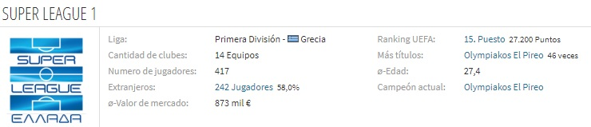

```{r global_options, echo=FALSE, message=FALSE, warning=FALSE, paged.print=TRUE}
knitr::opts_chunk$set(fig.path="", message=FALSE, warning=FALSE,
                      echo=FALSE, results="show", fig.width=11)
```


```{r echo=FALSE, message=FALSE, warning=FALSE, paged.print=FALSE}
library(readxl)
library(reshape2)
library(dplyr)
library(e1071)
library(Hmisc)
library(inspectdf) #este no lo tienen
library(funModeling) #este no lo tienen
library(VIM) #este no lo tienen
library(stringr)
library(xtable) #este no lo tienen
library(ggplot2)
library(directlabels)
library(scales)
library(ggthemes)
library(mice)
library(BBmisc)
library(dplyr)
library(janitor)
library(stringr)


descriptivas<- function(x){data.frame("MEDIDA"=c("Observaciones", "Mínimo", "1er Q", "Media", "Mediana", "Desv Est", "3er Q", "Máximo", "Asimetría", "Curtosis", "atípico leve<", "atípico leve>","atípico extremo<","atípico extremo>", "Err Est Media", "IC(95%) Media Up", "IC(95%) Media Down"),"VALOR"=format(c(length(na.omit(x)), min(na.omit(x)), quantile(na.omit(x), prob=0.25), mean(na.omit(x)), median(na.omit(x)), sd(na.omit(x)), quantile(na.omit(x), prob=0.75), max(na.omit(x)), skewness(na.omit(x)), kurtosis(na.omit(x)), (2.5*quantile(na.omit(x),prob=0.25)-1.5*quantile(na.omit(x), prob=0.75)),(2.5*quantile(na.omit(x),prob=0.75)-1.5*quantile(na.omit(x), prob=0.25)),(4*quantile(na.omit(x),prob=0.25)-3*quantile(na.omit(x), prob=0.75)),(4*quantile(na.omit(x),prob=0.75)-3*quantile(na.omit(x), prob=0.25)), ((sd(na.omit(x))/sqrt(length(na.omit(x))))), (mean(na.omit(x))+1.96*(sd(na.omit(x))/sqrt(length(na.omit(x))))), (mean(na.omit(x))-1.96*((sd(na.omit(x))/sqrt(length(na.omit(x))))))), scientific = F))}
#FUNCIÓN PARA ESTADÍSTICAS DESCRIPTIVAS PARA VARIABLES CONTINUAS

descriptivas2<-function(Continua,Categorías){
  x1=aggregate.data.frame(Continua, by=list(Categorías), FUN=function(x){length(na.omit(x))})
  names(x1)=c("Categoría","Obs")
  x2=aggregate.data.frame(Continua, by=list(Categorías), FUN=function(x){min(na.omit(x))})
  names(x2)=c("Categoría","Mínimo")
  x3=aggregate.data.frame(Continua, by=list(Categorías), FUN=function(x){quantile(na.omit(x), prob =0.25)})
  names(x3)=c("Categoría","1er Q")
  x4=aggregate.data.frame(Continua, by=list(Categorías), FUN=function(x){median(na.omit(x))})
  names(x4)=c("Categoría","Mediana")
  x5=aggregate.data.frame(Continua, by=list(Categorías), FUN=function(x){mean(na.omit(x))})
  names(x5)=c("Categoría","Media")
  x6=aggregate.data.frame(Continua, by=list(Categorías), FUN=function(x){quantile(na.omit(x), prob =0.75)})
  names(x6)=c("Categoría","3er Q")
  x7=aggregate.data.frame(Continua, by=list(Categorías), FUN=function(x){max(na.omit(x))})
  names(x7)=c("Categoría","Máximo")
  x8=aggregate.data.frame(Continua, by=list(Categorías), FUN=function(x){sd(na.omit(x))})
  names(x8)=c("Categoría","Desv Est")
  x9=aggregate.data.frame(Continua, by=list(Categorías), FUN=function(x){skewness(na.omit(x))})
  names(x9)=c("Categoría","Asimetría")
  x10=aggregate.data.frame(Continua, by=list(Categorías), FUN=function(x){kurtosis(na.omit(x))})
  names(x10)=c("Categoría","Curtosis")
  cbind(x1,x2,x3,x4,x5,x6,x7,x8,x9,x10)[,-seq(3,19,2)]
}
#FUNCIÓN PARA ESTADÍSTICAS DESCRIPTIVAS PARA VARIABLES CONTINUAS EN SUBMUESTRAS
  
tabla_freq<- function(x,total=1,na="ifany"){
  if (total==1) {
    M=data.frame("Categoría"=table(x, useNA = na), "Rel"=prop.table(table(x,useNA = na)))[,-3]
    names(M)=c("Categoría","Freq. Abs.","Freq. Rel.")
    M$Categoría=as.character(M$Categoría)
    M[nrow(M)+1,]=c("Total",sum(M$`Freq. Abs.`),sum(M$`Freq. Rel.`))
    M$`Freq. Rel.`=as.numeric(M$`Freq. Rel.`)
    M$`Freq. Abs.`=as.numeric(M$`Freq. Abs.`)
    M
  } else{
    M=data.frame("Categoría"=table(x, useNA = na), "Rel"=prop.table(table(x,useNA = na)))[,-3]
    names(M)=c("Categoría","Freq. Abs.","Freq. Rel.")
    M
  }
}
#FUNCIÓN PARA ESTADÍSTICAS DESCRIPTIVAS PARA VAR DISCRETAS

tabla_freq2<-function(x,y,na="ifany",prop=0, suma=c("filas","col")){
  if (prop==0) {
    M=as.data.frame.matrix(table(x, y, useNA = na))
    M$Categoría=row.names(M)
    rownames(M)=NULL
    M=M[,c(ncol(M),1:ncol(M)-1)]
    M$Categoría=as.character(M$Categoría)
    M[nrow(M)+1,]=c("Total",colSums(M[,2:ncol(M)]))
    M[,2:ncol(M)]=sapply(M[,2:ncol(M)], as.numeric)
    M$Total=rowSums(M[,2:ncol(M)])
    M
  } else if (prop==1 & suma=="filas") {
    M=as.data.frame.matrix(table(x, y, useNA = na))
    M$Categoría=row.names(M)
    rownames(M)=NULL
    M=M[,c(ncol(M),1:ncol(M)-1)]
    M$Categoría=as.character(M$Categoría)
    M[nrow(M)+1,]=c("Total",colSums(M[,2:ncol(M)]))
    M[,2:ncol(M)]=sapply(M[,2:ncol(M)], as.numeric)
    M$Total=rowSums(M[,2:ncol(M)])
    for (i in 2:ncol(M)) {
      M[,i]=M[,i]/M[,ncol(M)]
    }
    M
  } else {
    M=as.data.frame.matrix(table(x, y, useNA = na))
    M$Categoría=row.names(M)
    rownames(M)=NULL
    M=M[,c(ncol(M),1:ncol(M)-1)]
    M$Categoría=as.character(M$Categoría)
    M[nrow(M)+1,]=c("Total",colSums(M[,2:ncol(M)]))
    M[,2:ncol(M)]=sapply(M[,2:ncol(M)], as.numeric)
    M$Total=rowSums(M[,2:ncol(M)])
    for (i in 1:nrow(M)) {
      M[i,2:ncol(M)]=M[i,2:ncol(M)]/M[nrow(M),2:ncol(M)]
    }
    M 
  }
}
```

# Introducción
El 11 de marzo de 2020, la Organización Mundial de la Salud declaró una pandemia. Rápidamente se fue paralizando el mundo. A esa fecha se habían confirmado 117.573.007 casos y registrado [2.610.925 muertes](https://www.frontiersin.org/articles/10.3389/fspor.2021.695922/full#B36). Los países afectados se vieron en la necesidad de implementar diferentes tipos de restricción que impactaron la manera en que estábamos acostumbrados a movilizarnos, más allá del impacto en salubridad por el COVID-19. En vista de las masas que mueve el deporte, entre otros espectáculos, este tipo de eventos se debió suspender. Entre otros, los Juegos Olímpicos y Paralímpicos de Tokio fueron aplazados. Gracias a la evolución en los tratamientos y a la aplicación de estrictos protocolos sanitarios, algunos campeonatos profesionales se reanudaron con algunas restricciones, por ejempo, limitados a realizarse a puerta cerrada en estadios vacíos. Bajo estas nuevas circunstancias, surge la inquietud al respecto de **cómo esta situación extraordinaria afectó el rendimiento de los equipos de fútbol**, en vista de la supuesta ventaja que ofrecían los juegos de local al contar con la mayoría de espectadores alentando. Según estudios ^1^ basados en datos históricos, los equipos locales ganan de manera consistente más del 50% de los partidos jugados sobre un calendario equilibrado en juegos de local y visitante.

Nuestra firma, siempre interesada en producir valiosos insights para nuestros clientes y en atención a su solicitud al respecto, dedicó a uno de sus equipos de analítica a estudiar esta incógnita enfocado particularmente en dicho efecto sobre los equipos de la Súperliga de fútbol de Grecia. 

Los datos sobre los cuales está sustentado este análisis provienen de nuestra propia recolección y, Si bien nos ocuparemos en un trabajo futuro de revisar un modelo estadístico para medir el efecto de jugar a puerta cerrada durante situación de pandemia, sobre la ventaja de jugar de local, **en esta etapa cubrimos lo concerniente al análisis exploratorio de los datos**.

Este informe aporta a continuación algo de contexto respecto a la súperliga de Grecia y cuenta con cuatro secciones adicionales: en la primera, presentamos detalles respecto a los datos recolectados y a su estructura de variables; en la segunda nos referimos a los hallazgos en materia de anomalías y a las transformaciones realizadas en consecuencia. La tercera sección describe las variables que adicionamos para favorecer a los trabajos futuros y la última sección contempla algunas conclusiones acerca del proceso, así como, algunas recomendaciones de interés para los equipos de recolección de datos.

<font face="Courier New" size=1 align="left" >
/1. Ref. _Courneya, K. S., and Carron, A. V. (1992). The home advantage in sport competitions: a literature review. J. Sport Exerc. Psychol. 14, 13–27. doi: 10.1123/jsep.14.1.13_

</font>

## Superliga de Grecia  {.tabset .tabset-fade .tabset-pills}

La Superliga de Grecia (en griego, Ελληνική Σούπερ Λίγκα) es una competición entre clubes de fútbol de Grecia. Es la primera división del fútbol griego.


<font size=1> *Fuente. Transfermarkt.es* </font>

### Sistema de competición

La Federación Helénica de Fútbol organiza este torneo de liga y el sistema de puntuación es el siguiente: tres puntos para el vencedor de un partido, cero puntos para el perdedor de un partido y en caso de que dos equipos hayan empatado un partido, se les compensa con un punto para cada uno. La Superliga otorga dos plazas para la UEFA Champions League (campeón y subcampeón) y dos para la UEFA Europa League (tercero y cuarto), además de la del campeón de la Copa de Grecia.

Los 14 equipos participantes juegan entre sí todos contra todos a dos ruedas, totalizando 26 partidos cada uno. Al término de la fecha 26, los seis primeros clasificados disputarán la Ronda campeonato, mientras que los ocho restantes pasarán a jugar la Ronda por la permanencia. Los puntos obtenidos hasta la última fecha de la fase regular serán transferidos a la segunda fase, respectivamente a la zona en que se encuentre cada club.

A partir de noviembre de 2021, la Superliga griega ocupa el puesto 19 en la clasificación de ligas de la UEFA, basada en los resultados de las competiciones europeas de los últimos cinco años. Desde la fundación del primer Campeonato Panhelénico oficial en 1927, *sólo seis clubes han ganado el título*.

### Temporadas 2018-2022 {.tabset .tabset-fade .tabset-pills}

En función de aportar elementos de contexto a nuestro análisis, algunos datos de interés que hicieron parte de nuestra investigación son:

#### 2021-2022
La temporada 2021-22 es la edición número 85 de la Superliga de Grecia. La misma comenzó el 11 de septiembre de 2021 y terminará en mayo de 2022. Olympiakos es el campeón defensor.

#### 2020-2021
La temporada inició el 11 de septiembre de 2020 y finalizó el 19 mayo 2021.  El campeón fue Olympiakos y 
Descendieron Panaitolikos y AE Larisa.  LOs partidos se disputaron con público a partir del 24 de octubre de 2020 con el 10% del aforo.

#### 2019-2020
La temporada comenzó el 24 de agosto de 2019 y finalizó el 19 de julio de 2020.  El campeón fue Olympiakos y 
Descendieron Xanthi y Panionios.  Los partidos posteriores al 1 de marzo de 2020 se disputaron sin público.

#### 2018-2019
La temporada comenzó el 25 de agosto de 2018 y finalizó el 12 de mayo de 2019. El PAOK de Atenas fue el campeón.
Descendieron  Giannina, Levadiakos y Apollon Smyrnis. Asciende Volos.

### Estadios 
A continuación se muestra la lista de clubes que compiten en la Superliga 2021-22, con su respectiva ubicación y capacidad de estadio cuando juegan de local.

Equipo              | Ciudad       | Estadio                          | Capacidad
------------------- | ------------ | -------------------------------  | ----------
AEK Atenas          | Atenas       | Estadio Olímpico de Atenas       | 69.618
Apollon Smyrnis     | Atenas       | Georgios Kamaras Stadium         | 14.200
Aris Thess          | Thessaloniki | Estadio Kleanthis Vikelidis      |	22.800
Asteras Trípoli     | Trípoli      | Estadio Theodoros Kolokotronis	  |  7.442
Atromitos           | Peristeri    | Estadio Peristeri                |  9.050
Lamia               | Lamía        | Estadio Municipal de Lamia       |  5.500
OFI                 | Heraklion    | Estadio Theodoros Vardinogiannis |  9.088
Olympiakos          | Piraeus      | Estadio Georgios Karaiskakis     | 32.115
Panathinaikos       | Atenas       | Estadio Apostolos Nikolaidis     | 16.620
Panetolikos         | Agrinio      | Estadio Panetolikos              |  7.321
PAOK Salónica       | Thessaloni   | Estadio La Tumba                 | 28.703
PAS Giannina        | Ioannina     | Estadio Zosimades                |  7.652
Volos               | Volos        | Estadio Panthessaliko            | 22.700

En contexto, la capacidad de los estadios puede determinar la influencia mayor o menor que algunos equipos tienen al jugar de local, en vista por supuesto de la amplia diferencia en capacidad de espectadores que moviliza.  

# Sobre los datos

## Recolección {.tabset .tabset-fade .tabset-pills}

Los datos proceden de fuente propia producto de la recolección por parte de nuestro equipo y se dispusieron en tres 3 bases de datos: Temporada 2018-2019, Temporada 2019-2020 y Temporada 2020-2021. 

```{r echo=FALSE, message=FALSE, warning=FALSE, paged.print=FALSE}

setwd("./")
base1819 = read_excel("Grecia.xlsx", sheet = 3)
base1920 = read_excel("Grecia.xlsx", sheet = 2)
base2021 = read_excel("Grecia.xlsx", sheet = 1)

```

### Temporada 2018-1019
En esta base de datos se encuentran la información de los partidos disputados en la temporada 2018-2019 de la  Superliga de Grecia, distribuida en `r ncol(base1819)` columnas y `r nrow(base1819)` observaciones.

### Temporada 2019-2020
En esta base de datos se encuentran la información de los partidos disputados en la temporada 2019-2020 de la  Superliga de Grecia, distribuida en `r ncol(base1920)` columnas y `r nrow(base1920)` observaciones.

### Temporada 2020-2021
En esta base de datos se encuentran la información de los partidos disputados en la temporada 2020-2021 de la  Superliga de Grecia, distribuida en `r ncol(base2021)` columnas y `r nrow(base2021)` observaciones.

El número de columnas que contiene la base de datos es de `r ncol(base2021)` y el número de registros cargados es de `r nrow(base2021)`.

## Consolidación de los datos {.tabset .tabset-fade .tabset-pills}

### Unión de las fuentes
Al realizar el análisis para unir las fuentes mencionadas revisamos las diferencias en la estructura de cada una de ellas, a fin de determinar cuales son las variables de la fuente que dispondremos para el proyecto.

<font size=2>
_Tabla. Columnas con diferencias entre las bases de datos_
```{r}
compare_df_cols(base1819, base1920, base2021, return = "mismatch", bind_method = "rbind")

```
</font>

### Presentación de las variables
```{r}
base18_20= union_all(base1819, base1920)
base18_21= union_all(base18_20, base2021)

base_filtrada= base18_21[,c(2:22,41:47)]
```

Unir las fuentes nos representó una nueva base de datos de información de los partidos disputados en las tres temporadas (2018-2019, 2019-2020 y 2020-2021) de la Superliga de Grecia, cuyas dimensiones son `r ncol(base18_21)` columnas y `r nrow(base18_21)` registros, caracterizada por grupos de variables que se refieren a:

* Datos básicos del partido
* Estadísticas del juego
* Cuotas de casas de apuestas

Usando información derivada del análisis de diferencias en las columnas no comunes a todas las fuentes, además de nuestra investigación respecto a la Superliga de Grecia y en consecuencia del objetivo que persigue el presente proyecto de analítica, determinamos que las siguientes `r ncol(base_filtrada)` columnas son definitivamente las variables de interés para el presente análisis y sobre ellas desarrollaremos las actividades de aseguramiento de calidad en los datos.

<font size=2>
```{r}

# declaring the columns of data frame
# assigning new names to the columns of the data frame
colnames(base_filtrada) <- c('FECHA','EQUIPO_LOCAL','EQUIPO_VISITANTE','LOCAL_GOLES','VISITANTE_GOLES','RESULTADO_FINAL','LOCAL_GOLES_MITAD', 'VISITANTE_GOLES_MITAD', 'RESULTADO_MITAD', 'LOCAL_TIROS', 'VISITANTE_TIROS', 'LOCAL_TIROS_PUERTA', 'VISITANTE_TIROS_PUERTA', 'LOCAL_TIROS_LIBRES', 'VISITANTE_TIROS_LIBRES', 'LOCAL_CORNERS', 'VISITANTE_CORNERS', 'LOCAL_AMARILLAS', 'VISITANTE_AMARILLAS', 'LOCAL_ROJAS', 'VISITANTE_ROJAS', 'Bb1X2', 'BbMxH', 'BbAvH', 'BbMxD', 'BbAvD', 'BbMxA', 'BbAvA')

# printing new data frame

columnas= colnames(base_filtrada)
Tipo_variables = c( 
  "Cuantitativa Discreta", "Cualitativa Nominal", "Cualitativa Nominal", "Cuantitativa Discreta", "Cuantitativa Discreta", "Cualitativa Nominal", "Cuantitativa Discreta","Cuantitativa Discreta", "Cualitativa Nominal", "Cuantitativa Discreta","Cuantitativa Discreta", "Cuantitativa Discreta", "Cuantitativa Discreta", "Cuantitativa Discreta", "Cuantitativa Discreta", "Cuantitativa Discreta", "Cuantitativa Discreta", "Cuantitativa Discreta", "Cuantitativa Discreta", "Cuantitativa Discreta",  "Cuantitativa Discreta", "Cuantitativa Discreta", "Cuantitativa Contínua","Cuantitativa Contínua", "Cuantitativa Contínua", "Cuantitativa Contínua", "Cuantitativa Contínua", "Cuantitativa Contínua") 

rango_categorias = c( paste(format(min(base_filtrada$FECHA),"%d-%m-%Y"),format(max(base_filtrada$FECHA),"%d-%m-%Y"),sep = " a "), collapse(sort(unique(base_filtrada$EQUIPO_LOCAL[!is.na(base_filtrada$EQUIPO_LOCAL)])), sep = ", "), collapse(sort(unique(base_filtrada$EQUIPO_VISITANTE[!is.na(base_filtrada$EQUIPO_VISITANTE)])), sep = ", "),
paste(min(base_filtrada$LOCAL_GOLES, na.rm = TRUE),max(base_filtrada$LOCAL_GOLES, na.rm = TRUE), sep = " a "), paste(min(base_filtrada$VISITANTE_GOLES, na.rm = TRUE),max(base_filtrada$VISITANTE_GOLES, na.rm = TRUE), sep = " a "), collapse(unique(base_filtrada$RESULTADO_FINAL), sep = ", "), paste(min(base_filtrada$LOCAL_GOLES_MITAD, na.rm = TRUE),max(base_filtrada$LOCAL_GOLES_MITAD, na.rm = TRUE), sep = " a "), paste(min(base_filtrada$VISITANTE_GOLES_MITAD, na.rm = TRUE),max(base_filtrada$VISITANTE_GOLES_MITAD, na.rm = TRUE), sep = " a "), collapse(unique(base_filtrada$RESULTADO_MITAD), ", "), paste(min(base_filtrada$LOCAL_TIROS, na.rm = TRUE),max(base_filtrada$LOCAL_TIROS, na.rm = TRUE), sep = " a "), paste(min(base_filtrada$VISITANTE_TIROS, na.rm = TRUE),max(base_filtrada$VISITANTE_TIROS, na.rm = TRUE), sep = " a "), paste(min(base_filtrada$LOCAL_TIROS_PUERTA, na.rm = TRUE),max(base_filtrada$LOCAL_TIROS_PUERTA, na.rm = TRUE), sep = " a "), paste(min(base_filtrada$VISITANTE_TIROS_PUERTA, na.rm = TRUE),max(base_filtrada$VISITANTE_TIROS_PUERTA, na.rm = TRUE), sep = " a "), paste(min(base_filtrada$LOCAL_TIROS_LIBRES, na.rm = TRUE),max(base_filtrada$LOCAL_TIROS_LIBRES, na.rm = TRUE), sep = " a "), paste(min(base_filtrada$VISITANTE_TIROS_LIBRES, na.rm = TRUE),max(base_filtrada$VISITANTE_TIROS_LIBRES, na.rm = TRUE), sep = " a "), paste(min(base_filtrada$LOCAL_CORNERS, na.rm = TRUE),max(base_filtrada$LOCAL_CORNERS, na.rm = TRUE), sep = " a "), paste(min(base_filtrada$VISITANTE_CORNERS, na.rm = TRUE),max(base_filtrada$VISITANTE_CORNERS, na.rm = TRUE), sep = " a "), paste(min(base_filtrada$LOCAL_AMARILLAS, na.rm = TRUE),max(base_filtrada$LOCAL_AMARILLAS, na.rm = TRUE), sep = " a "), paste(min(base_filtrada$VISITANTE_AMARILLAS, na.rm = TRUE),max(base_filtrada$VISITANTE_AMARILLAS, na.rm = TRUE), sep = " a "), paste(min(base_filtrada$LOCAL_ROJAS, na.rm = TRUE),max(base_filtrada$LOCAL_ROJAS, na.rm = TRUE), sep = " a "), paste(min(base_filtrada$VISITANTE_ROJAS, na.rm = TRUE),max(base_filtrada$VISITANTE_ROJAS, na.rm = TRUE), sep = " a "), paste(min(base_filtrada$Bb1X2, na.rm = TRUE),max(base_filtrada$Bb1X2, na.rm = TRUE), sep = " a "), paste(min(base_filtrada$BbMxH, na.rm = TRUE),max(base_filtrada$BbMxH, na.rm = TRUE), sep = " a "), paste(min(base_filtrada$BbMxD, na.rm = TRUE),max(base_filtrada$BbMxD, na.rm = TRUE), sep = " a "), paste(min(base_filtrada$BbAvH, na.rm = TRUE),max(base_filtrada$BbAvH, na.rm = TRUE), sep = " a "), paste(min(base_filtrada$BbAvD, na.rm = TRUE),max(base_filtrada$BbAvD, na.rm = TRUE), sep = " a "), paste(min(base_filtrada$BbMxA, na.rm = TRUE),max(base_filtrada$BbMxA, na.rm = TRUE), sep = " a "), paste(min(base_filtrada$BbAvA, na.rm = TRUE),max(base_filtrada$BbAvA, na.rm = TRUE), sep = " a ") )

tabla_variables <- data.frame (columnas, Tipo_variables, rango_categorias)
knitr::kable(tabla_variables, "simple",   col.names = c('Variable', 'Tipo de variable', 'Rango / Categorías'), align = "llc", caption = "Tabla. Descripción de las Variables para el análisis")

```
</font>

Sobre esta  base de datos unificada las variables fueron renombradas respecto al origen a fin de manejar nombres más representativos que faciliten las subsiguientes etapas del proceso y la comunicación de los resultados. Una muestra de los datos se puede observar a continuación:
<font size=1>
```{r echo=FALSE}

head(base_filtrada)

```
</font>
_Tabla. Muestra premilinar de los datos_


# Detección de anomalías {.tabset .tabset-fade .tabset-pills}
En esta etapa del proceso nos ocupamos de compartir los hallazgos en materia de anomalías sobre los datos, usando las siguientes técnicas para su detección y evidenciando las razones que nos condujeron a tomar decisiones al respecto de su solución.

1.Formato de las variables no coincide con su tipo de variable
2.Observaciones duplicadas
3.Campos vacíos
4.Datos atípicos
5.Errores de digitación
6.Valores inválidos o sin referencia en el diccionario de variables
7.Valores inconsistentes

## Formato de las variables no coincide con su tipo de variable 

### Fecha

Identificamos que esta variable es leida del origen cómo tipo *`r class(base_filtrada$FECHA)`*. 
```{r Tratamiento fecha, include=FALSE}
base_filtrada$FECHA = as.Date(base_filtrada$FECHA,format= "%Y-%m-%d")
class(base_filtrada$FECHA)

```
A fin de facilitar el tratamiento con esta variable, la corrección consiste en realizar el cambio a tipo *`r class(base_filtrada$FECHA)`*.

### Equipo Local
Identificamos que esta variable es leida del origen cómo tipo *`r class(base_filtrada$EQUIPO_LOCAL)`*.
```{r}
base_filtrada$EQUIPO_LOCAL = factor(base_filtrada$EQUIPO_LOCAL)
```
A fin de facilitar el tratamiento con esta variable categórica, la corrección consiste en realizar el cambio a tipo *`r class(base_filtrada$EQUIPO_LOCAL)`*, cuyas categorías son: [*`r gsub(",", ", ", collapse(levels(base_filtrada$EQUIPO_LOCAL)))`*]

###Equipo visitante
Identificamos que esta variable es leida del origen cómo tipo *`r class(base_filtrada$EQUIPO_VISITANTE)`*.
```{r}
base_filtrada$EQUIPO_VISITANTE = factor(base_filtrada$EQUIPO_VISITANTE)
```
A fin de facilitar el tratamiento con esta variable categórica, la corrección consiste en realizar el cambio a tipo *`r class(base_filtrada$EQUIPO_VISITANTE)`*, cuyas categorías son: [*`r gsub(",", ", ", collapse(levels(base_filtrada$EQUIPO_VISITANTE)))`*]

### Resultado final del partido
Identificamos que esta variable es leida del origen cómo tipo *`r class(base_filtrada$RESULTADO_FINAL)`*.
```{r}
base_filtrada$RESULTADO_FINAL = factor(base_filtrada$RESULTADO_FINAL, labels= c("Visitante","Empate","Local"))
```
A fin de facilitar el tratamiento con esta variable categórica, la corrección consiste en realizar el cambio a tipo *`r class(base_filtrada$RESULTADO_FINAL)`*, cuyas categorías son: [*`r gsub(",", ", ", collapse(levels(base_filtrada$RESULTADO_FINAL)))`*]

### Resultado al finalizar el primer tiempo
Identificamos que esta variable es leida del origen cómo tipo *`r class(base_filtrada$RESULTADO_MITAD)`*.
```{r}
base_filtrada$RESULTADO_MITAD = factor(base_filtrada$RESULTADO_MITAD, labels= c("Visitante","Empate","Local"))
```
A fin de facilitar el tratamiento con esta variable categórica, la corrección consiste en realizar el cambio a tipo *`r class(base_filtrada$RESULTADO_MITAD)`*, cuyas categorías son: [*`r gsub(",", ", ", collapse(levels(base_filtrada$RESULTADO_MITAD)))`*]

### Tipo de dato en las variables cuantitativas discretas 
Efectuamos la corrección de las variables cuantitativas discretas pasándolas a tipo *integer* : [*`r gsub(",", ", ", collapse(tabla_variables$columnas[tabla_variables$Tipo_variables=="Cuantitativa Discreta" & tabla_variables$columnas!="FECHA"]))`*].

```{r}
base_filtrada$LOCAL_GOLES           = as.integer(base_filtrada$LOCAL_GOLES)
base_filtrada$VISITANTE_GOLES       = as.integer(base_filtrada$VISITANTE_GOLES)
base_filtrada$LOCAL_GOLES_MITAD     = as.integer(base_filtrada$LOCAL_GOLES_MITAD)
base_filtrada$VISITANTE_GOLES_MITAD = as.integer(base_filtrada$VISITANTE_GOLES_MITAD)
base_filtrada$LOCAL_TIROS           = as.integer(base_filtrada$LOCAL_TIROS)
base_filtrada$VISITANTE_TIROS       = as.integer(base_filtrada$VISITANTE_TIROS)
base_filtrada$LOCAL_TIROS_PUERTA    = as.integer(base_filtrada$LOCAL_TIROS_PUERTA)
base_filtrada$VISITANTE_TIROS_PUERTA= as.integer(base_filtrada$VISITANTE_TIROS_PUERTA)
base_filtrada$LOCAL_TIROS_LIBRES    = as.integer(base_filtrada$LOCAL_TIROS_LIBRES)
base_filtrada$VISITANTE_TIROS_LIBRES= as.integer(base_filtrada$VISITANTE_TIROS_LIBRES)
base_filtrada$LOCAL_CORNERS         = as.integer(base_filtrada$LOCAL_CORNERS)
base_filtrada$VISITANTE_CORNERS      = as.integer(base_filtrada$VISITANTE_CORNERS)
base_filtrada$LOCAL_AMARILLAS       = as.integer(base_filtrada$LOCAL_AMARILLAS)
base_filtrada$VISITANTE_AMARILLAS   = as.integer(base_filtrada$VISITANTE_AMARILLAS)
base_filtrada$LOCAL_ROJAS           = as.integer(base_filtrada$LOCAL_ROJAS)
base_filtrada$VISITANTE_ROJAS       = as.integer(base_filtrada$VISITANTE_ROJAS)
base_filtrada$Bb1X2                 = as.integer(base_filtrada$Bb1X2)
```

### Tipo de dato en las variables cuantitativas continuas
Efectuamos la corrección de las variables cuantitativas discretas pasándolas a tipo *numeric* : [*`r gsub(",", ", ", collapse(tabla_variables$columnas[tabla_variables$Tipo_variables=="Cuantitativa Contínua"]))`*].

```{r}
base_filtrada$BbMxH = as.numeric(base_filtrada$BbMxH)	
base_filtrada$BbAvH = as.numeric(base_filtrada$BbAvH)	
base_filtrada$BbMxD = as.numeric(base_filtrada$BbMxD)	
base_filtrada$BbAvD = as.numeric(base_filtrada$BbAvD)	
base_filtrada$BbMxA = as.numeric(base_filtrada$BbMxA)	
base_filtrada$BbAvA = as.numeric(base_filtrada$BbAvA)
```

## Observaciones duplicadas
Realizamos la validación de registros duplicados detectando `r nrow(base_filtrada[duplicated(base_filtrada), ])` de los `r nrow(base_filtrada)` registros de la base de datos:
```{r}
base_filtrada[duplicated(base_filtrada),]
base_filtrada = base_filtrada[!duplicated(base_filtrada), ]
```
En vista de que estos registros idénticos producirían sesgos en el momento de contabilizar estos partidos, determinamos eliminarlos, con lo cual la base de datos sea actualiza a `r nrow(base_filtrada)` registros.

## Campos vacíos

```{r}
inspect_na(base_filtrada)
capture.output(aggr(base_filtrada, numbers=TRUE, prop=FALSE, sortVars=TRUE, cex.axis = 0.7, cex.numbers = 0.7), file=tempfile())
```

Tenemos 9 variables que tienen 481 NA's los cuales representan un 66% del dataset. Entraremos analizarlas
```{r}
summary(base_filtrada)
aggr(base_filtrada, numbers=T, prop=F,sortVars = T,cex.axis = 0.5)
```
Nos damos cuenta que las siguientes 9 variables nulas se encuentran concentradas en 478 registros por lo que se deciden a borrar las siguientes columnas:
LOCAL_TIROS_LIBRES
VISITANTE_TIROS_LIBRES
Bb1X2
BbMxH
BbAvH
BbMxD
BbAvD
BbMxA
BbAvA
La mayoria de estas variables hacen referencia a cuotas de apuestas publicadas en BetBrain.
```{r}
base_filtrada[rowSums(is.na(base_filtrada))==9,]
base_filtrada= subset( base_filtrada, select = -c(LOCAL_TIROS_LIBRES, VISITANTE_TIROS_LIBRES, Bb1X2, BbMxH, BbAvH, BbMxD, BbAvD, BbMxA, BbAvA) )
str(base_filtrada)
```
De las variables restantes tambien encontramos una cantidad minima de NA's la cual entraremos analizar 
```{r}
summary(base_filtrada)
```
Encontramos que los anteriores NA's mencionados se distribuyen en 11 registros. La fila que solo contiene la fecha sera eliminada, mientras que las otras se les imputara los datos por medio de Web Scraping manual, a partir de la información de la siguiente pagina Web: [Estadisticas](https://www.transfermarkt.mx/)
```{r}
base_filtrada[rowSums(is.na(base_filtrada)) > 0,]
base_filtrada = base_filtrada[!rowSums(is.na(base_filtrada)) > 15,]
```

```{r}
## OFI Crete	VS PAOK
base_filtrada$LOCAL_TIROS[base_filtrada$FECHA == as.Date("2018-09-15") & base_filtrada$EQUIPO_LOCAL== "OFI Crete"]= 4
base_filtrada$VISITANTE_TIROS[base_filtrada$FECHA == as.Date("2018-09-15") & base_filtrada$EQUIPO_LOCAL== "OFI Crete"]= 6
base_filtrada$LOCAL_TIROS_PUERTA[base_filtrada$FECHA == as.Date("2018-09-15") & base_filtrada$EQUIPO_LOCAL== "OFI Crete"]= 2
base_filtrada$VISITANTE_TIROS_PUERTA[base_filtrada$FECHA == as.Date("2018-09-15") & base_filtrada$EQUIPO_LOCAL== "OFI Crete"]= 4
base_filtrada$LOCAL_CORNERS[base_filtrada$FECHA == as.Date("2018-09-15") & base_filtrada$EQUIPO_LOCAL== "OFI Crete"]= 1
base_filtrada$VISITANTE_CORNERS[base_filtrada$FECHA == as.Date("2018-09-15") & base_filtrada$EQUIPO_LOCAL== "OFI Crete"]= 3
base_filtrada$LOCAL_AMARILLAS[base_filtrada$FECHA == as.Date("2018-09-15") & base_filtrada$EQUIPO_LOCAL== "OFI Crete"]= 4
base_filtrada$VISITANTE_AMARILLAS[base_filtrada$FECHA == as.Date("2018-09-15") & base_filtrada$EQUIPO_LOCAL== "OFI Crete"]= 3
base_filtrada$LOCAL_ROJAS[base_filtrada$FECHA == as.Date("2018-09-15") & base_filtrada$EQUIPO_LOCAL== "OFI Crete"]= 0
base_filtrada$VISITANTE_ROJAS[base_filtrada$FECHA == as.Date("2018-09-15") & base_filtrada$EQUIPO_LOCAL== "OFI Crete"]= 0

## Atromitos	VS Lamia
base_filtrada$LOCAL_TIROS[base_filtrada$FECHA == as.Date("2018-09-16") & base_filtrada$EQUIPO_LOCAL== "Atromitos"]= 8
base_filtrada$VISITANTE_TIROS[base_filtrada$FECHA == as.Date("2018-09-16") & base_filtrada$EQUIPO_LOCAL== "Atromitos"]= 9
base_filtrada$LOCAL_TIROS_PUERTA[base_filtrada$FECHA == as.Date("2018-09-16") & base_filtrada$EQUIPO_LOCAL== "Atromitos"]= 5
base_filtrada$VISITANTE_TIROS_PUERTA[base_filtrada$FECHA == as.Date("2018-09-16") & base_filtrada$EQUIPO_LOCAL== "Atromitos"]= 5
base_filtrada$LOCAL_CORNERS[base_filtrada$FECHA == as.Date("2018-09-16") & base_filtrada$EQUIPO_LOCAL== "Atromitos"]= 6
base_filtrada$VISITANTE_CORNERS[base_filtrada$FECHA == as.Date("2018-09-16") & base_filtrada$EQUIPO_LOCAL== "Atromitos"]= 3
base_filtrada$LOCAL_AMARILLAS[base_filtrada$FECHA == as.Date("2018-09-16") & base_filtrada$EQUIPO_LOCAL== "Atromitos"]= 1
base_filtrada$VISITANTE_AMARILLAS[base_filtrada$FECHA == as.Date("2018-09-16") & base_filtrada$EQUIPO_LOCAL== "Atromitos"]= 1
base_filtrada$LOCAL_ROJAS[base_filtrada$FECHA == as.Date("2018-09-16") & base_filtrada$EQUIPO_LOCAL== "Atromitos"]= 0
base_filtrada$VISITANTE_ROJAS[base_filtrada$FECHA == as.Date("2018-09-16") & base_filtrada$EQUIPO_LOCAL== "Atromitos"]= 1

## Larisa	VS Panathinaikos
base_filtrada$LOCAL_TIROS[base_filtrada$FECHA == as.Date("2018-09-16") & base_filtrada$EQUIPO_LOCAL== "Larisa"]= 6
base_filtrada$VISITANTE_TIROS[base_filtrada$FECHA == as.Date("2018-09-16") & base_filtrada$EQUIPO_LOCAL== "Larisa"]= 11
base_filtrada$LOCAL_TIROS_PUERTA[base_filtrada$FECHA == as.Date("2018-09-16") & base_filtrada$EQUIPO_LOCAL== "Larisa"]= 3
base_filtrada$VISITANTE_TIROS_PUERTA[base_filtrada$FECHA == as.Date("2018-09-16") & base_filtrada$EQUIPO_LOCAL== "Larisa"]= 8
base_filtrada$LOCAL_CORNERS[base_filtrada$FECHA == as.Date("2018-09-16") & base_filtrada$EQUIPO_LOCAL== "Larisa"]= 5
base_filtrada$VISITANTE_CORNERS[base_filtrada$FECHA == as.Date("2018-09-16") & base_filtrada$EQUIPO_LOCAL== "Larisa"]= 3
base_filtrada$LOCAL_AMARILLAS[base_filtrada$FECHA == as.Date("2018-09-16") & base_filtrada$EQUIPO_LOCAL== "Larisa"]= 5
base_filtrada$VISITANTE_AMARILLAS[base_filtrada$FECHA == as.Date("2018-09-16") & base_filtrada$EQUIPO_LOCAL== "Larisa"]= 2
base_filtrada$LOCAL_ROJAS[base_filtrada$FECHA == as.Date("2018-09-16") & base_filtrada$EQUIPO_LOCAL== "Larisa"]= 0
base_filtrada$VISITANTE_ROJAS[base_filtrada$FECHA == as.Date("2018-09-16") & base_filtrada$EQUIPO_LOCAL== "Larisa"]= 0

## Olympiakos	VS Asteras Tripolis
base_filtrada$LOCAL_TIROS[base_filtrada$FECHA == as.Date("2018-09-16") & base_filtrada$EQUIPO_LOCAL== "Olympiakos"]= 13
base_filtrada$VISITANTE_TIROS[base_filtrada$FECHA == as.Date("2018-09-16") & base_filtrada$EQUIPO_LOCAL== "Olympiakos"]= 7
base_filtrada$LOCAL_TIROS_PUERTA[base_filtrada$FECHA == as.Date("2018-09-16") & base_filtrada$EQUIPO_LOCAL== "Olympiakos"]= 10
base_filtrada$VISITANTE_TIROS_PUERTA[base_filtrada$FECHA == as.Date("2018-09-16") & base_filtrada$EQUIPO_LOCAL== "Olympiakos"]= 4
base_filtrada$LOCAL_CORNERS[base_filtrada$FECHA == as.Date("2018-09-16") & base_filtrada$EQUIPO_LOCAL== "Olympiakos"]= 2
base_filtrada$VISITANTE_CORNERS[base_filtrada$FECHA == as.Date("2018-09-16") & base_filtrada$EQUIPO_LOCAL== "Olympiakos"]= 4
base_filtrada$LOCAL_AMARILLAS[base_filtrada$FECHA == as.Date("2018-09-16") & base_filtrada$EQUIPO_LOCAL== "Olympiakos"]= 2
base_filtrada$VISITANTE_AMARILLAS[base_filtrada$FECHA == as.Date("2018-09-16") & base_filtrada$EQUIPO_LOCAL== "Olympiakos"]= 2
base_filtrada$LOCAL_ROJAS[base_filtrada$FECHA == as.Date("2018-09-16") & base_filtrada$EQUIPO_LOCAL== "Olympiakos"]= 0
base_filtrada$VISITANTE_ROJAS[base_filtrada$FECHA == as.Date("2018-09-16") & base_filtrada$EQUIPO_LOCAL== "Olympiakos"]= 0

## Xanthi VS	Panetolikos
base_filtrada$LOCAL_TIROS[base_filtrada$FECHA == as.Date("2018-09-16") & base_filtrada$EQUIPO_LOCAL== "Xanthi"]= 17
base_filtrada$VISITANTE_TIROS[base_filtrada$FECHA == as.Date("2018-09-16") & base_filtrada$EQUIPO_LOCAL== "Xanthi"]= 2
base_filtrada$LOCAL_TIROS_PUERTA[base_filtrada$FECHA == as.Date("2018-09-16") & base_filtrada$EQUIPO_LOCAL== "Xanthi"]= 7
base_filtrada$VISITANTE_TIROS_PUERTA[base_filtrada$FECHA == as.Date("2018-09-16") & base_filtrada$EQUIPO_LOCAL== "Xanthi"]= 2
base_filtrada$LOCAL_CORNERS[base_filtrada$FECHA == as.Date("2018-09-16") & base_filtrada$EQUIPO_LOCAL== "Xanthi"]= 10
base_filtrada$VISITANTE_CORNERS[base_filtrada$FECHA == as.Date("2018-09-16") & base_filtrada$EQUIPO_LOCAL== "Xanthi"]= 0
base_filtrada$LOCAL_AMARILLAS[base_filtrada$FECHA == as.Date("2018-09-16") & base_filtrada$EQUIPO_LOCAL== "Xanthi"]= 3
base_filtrada$VISITANTE_AMARILLAS[base_filtrada$FECHA == as.Date("2018-09-16") & base_filtrada$EQUIPO_LOCAL== "Xanthi"]= 2
base_filtrada$LOCAL_ROJAS[base_filtrada$FECHA == as.Date("2018-09-16") & base_filtrada$EQUIPO_LOCAL== "Xanthi"]= 0
base_filtrada$VISITANTE_ROJAS[base_filtrada$FECHA == as.Date("2018-09-16") & base_filtrada$EQUIPO_LOCAL== "Xanthi"]= 0

## Aris	VS Levadeiakos
base_filtrada$LOCAL_TIROS[base_filtrada$FECHA == as.Date("2018-09-17") & base_filtrada$EQUIPO_LOCAL== "Aris"]= 8
base_filtrada$VISITANTE_TIROS[base_filtrada$FECHA == as.Date("2018-09-17") & base_filtrada$EQUIPO_LOCAL== "Aris"]= 11
base_filtrada$LOCAL_TIROS_PUERTA[base_filtrada$FECHA == as.Date("2018-09-17") & base_filtrada$EQUIPO_LOCAL== "Aris"]= 3
base_filtrada$VISITANTE_TIROS_PUERTA[base_filtrada$FECHA == as.Date("2018-09-17") & base_filtrada$EQUIPO_LOCAL== "Aris"]= 4
base_filtrada$LOCAL_CORNERS[base_filtrada$FECHA == as.Date("2018-09-17") & base_filtrada$EQUIPO_LOCAL== "Aris"]= 4
base_filtrada$VISITANTE_CORNERS[base_filtrada$FECHA == as.Date("2018-09-17") & base_filtrada$EQUIPO_LOCAL== "Aris"]= 3
base_filtrada$LOCAL_AMARILLAS[base_filtrada$FECHA == as.Date("2018-09-17") & base_filtrada$EQUIPO_LOCAL== "Aris"]= 3
base_filtrada$VISITANTE_AMARILLAS[base_filtrada$FECHA == as.Date("2018-09-17") & base_filtrada$EQUIPO_LOCAL== "Aris"]= 4
base_filtrada$LOCAL_ROJAS[base_filtrada$FECHA == as.Date("2018-09-17") & base_filtrada$EQUIPO_LOCAL== "Aris"]= 0
base_filtrada$VISITANTE_ROJAS[base_filtrada$FECHA == as.Date("2018-09-17") & base_filtrada$EQUIPO_LOCAL== "Aris"]= 0

## Panionios VS Atromitos
base_filtrada$LOCAL_GOLES[base_filtrada$FECHA == as.Date("2018-10-28") & base_filtrada$EQUIPO_LOCAL== "Panionios"]= 2
base_filtrada$VISITANTE_GOLES[base_filtrada$FECHA == as.Date("2018-10-28") & base_filtrada$EQUIPO_LOCAL== "Panionios"]= 2

## Panathinaikos VS	Olympiakos
base_filtrada$LOCAL_GOLES[base_filtrada$FECHA == as.Date("2019-03-17") & base_filtrada$EQUIPO_LOCAL== "Panathinaikos"]= 0
base_filtrada$VISITANTE_GOLES[base_filtrada$FECHA == as.Date("2019-03-17") & base_filtrada$EQUIPO_LOCAL== "Panathinaikos"]= 3
base_filtrada$RESULTADO_FINAL[base_filtrada$FECHA == as.Date("2019-03-17") & base_filtrada$EQUIPO_LOCAL== "Panathinaikos"]= "Visitante"
base_filtrada$LOCAL_TIROS[base_filtrada$FECHA == as.Date("2019-03-17") & base_filtrada$EQUIPO_LOCAL== "Panathinaikos"]= 6
base_filtrada$VISITANTE_TIROS[base_filtrada$FECHA == as.Date("2019-03-17") & base_filtrada$EQUIPO_LOCAL== "Panathinaikos"]= 12
base_filtrada$LOCAL_TIROS_PUERTA[base_filtrada$FECHA == as.Date("2019-03-17") & base_filtrada$EQUIPO_LOCAL== "Panathinaikos"]= 3
base_filtrada$VISITANTE_TIROS_PUERTA[base_filtrada$FECHA == as.Date("2019-03-17") & base_filtrada$EQUIPO_LOCAL== "Panathinaikos"]= 5
base_filtrada$LOCAL_CORNERS[base_filtrada$FECHA == as.Date("2019-03-17") & base_filtrada$EQUIPO_LOCAL== "Panathinaikos"]= 4
base_filtrada$VISITANTE_CORNERS[base_filtrada$FECHA == as.Date("2019-03-17") & base_filtrada$EQUIPO_LOCAL== "Panathinaikos"]= 2
base_filtrada$LOCAL_AMARILLAS[base_filtrada$FECHA == as.Date("2019-03-17") & base_filtrada$EQUIPO_LOCAL== "Panathinaikos"]= 0
base_filtrada$VISITANTE_AMARILLAS[base_filtrada$FECHA == as.Date("2019-03-17") & base_filtrada$EQUIPO_LOCAL== "Panathinaikos"]= 1
base_filtrada$LOCAL_ROJAS[base_filtrada$FECHA == as.Date("2019-03-17") & base_filtrada$EQUIPO_LOCAL== "Panathinaikos"]= 0
base_filtrada$VISITANTE_ROJAS[base_filtrada$FECHA == as.Date("2019-03-17") & base_filtrada$EQUIPO_LOCAL== "Panathinaikos"]= 0

## Panathinaikos	VS OFI Crete
base_filtrada$LOCAL_GOLES_MITAD[base_filtrada$FECHA == as.Date("2019-08-31") & base_filtrada$EQUIPO_LOCAL== "Panathinaikos"]= 0
base_filtrada$VISITANTE_GOLES_MITAD[base_filtrada$FECHA == as.Date("2019-08-31") & base_filtrada$EQUIPO_LOCAL== "Panathinaikos"]= 1
base_filtrada$RESULTADO_MITAD[base_filtrada$FECHA == as.Date("2019-08-31") & base_filtrada$EQUIPO_LOCAL== "Panathinaikos"]= "A"
base_filtrada$LOCAL_TIROS[base_filtrada$FECHA == as.Date("2019-08-31") & base_filtrada$EQUIPO_LOCAL== "Panathinaikos"]= 4
base_filtrada$VISITANTE_TIROS[base_filtrada$FECHA == as.Date("2019-08-31") & base_filtrada$EQUIPO_LOCAL== "Panathinaikos"]= 10
base_filtrada$LOCAL_TIROS_PUERTA[base_filtrada$FECHA == as.Date("2019-08-31") & base_filtrada$EQUIPO_LOCAL== "Panathinaikos"]= 3
base_filtrada$VISITANTE_TIROS_PUERTA[base_filtrada$FECHA == as.Date("2019-08-31") & base_filtrada$EQUIPO_LOCAL== "Panathinaikos"]= 5
base_filtrada$LOCAL_CORNERS[base_filtrada$FECHA == as.Date("2019-08-31") & base_filtrada$EQUIPO_LOCAL== "Panathinaikos"]= 1
base_filtrada$VISITANTE_CORNERS[base_filtrada$FECHA == as.Date("2019-08-31") & base_filtrada$EQUIPO_LOCAL== "Panathinaikos"]= 1
base_filtrada$LOCAL_AMARILLAS[base_filtrada$FECHA == as.Date("2019-08-31") & base_filtrada$EQUIPO_LOCAL== "Panathinaikos"]= 6
base_filtrada$VISITANTE_AMARILLAS[base_filtrada$FECHA == as.Date("2019-08-31") & base_filtrada$EQUIPO_LOCAL== "Panathinaikos"]= 3
base_filtrada$LOCAL_ROJAS[base_filtrada$FECHA == as.Date("2019-08-31") & base_filtrada$EQUIPO_LOCAL== "Panathinaikos"]= 1
base_filtrada$VISITANTE_ROJAS[base_filtrada$FECHA == as.Date("2019-08-31") & base_filtrada$EQUIPO_LOCAL== "Panathinaikos"]= 0
```

```{r}
base_filtrada[base_filtrada$FECHA == as.Date("2018-09-16") | (base_filtrada$FECHA == as.Date("2018-09-15") & base_filtrada$EQUIPO_LOCAL== "OFI Crete") | (base_filtrada$FECHA == as.Date("2018-09-17") & base_filtrada$EQUIPO_LOCAL== "Aris") | (base_filtrada$FECHA == as.Date("2018-10-28") & base_filtrada$EQUIPO_LOCAL== "Panionios") | (base_filtrada$FECHA == as.Date("2019-03-17") & base_filtrada$EQUIPO_LOCAL== "Panathinaikos") |(base_filtrada$FECHA == as.Date("2019-08-31") & base_filtrada$EQUIPO_LOCAL== "Panathinaikos") ,]
```


### 4. Datos atípicos

Los valores -2 y NA, no tienen sentido dentro del significado de la variable (Cantidad de goles del local al terminar el partido).
Aunque 22 y 33 goles no es un valor invalido, si es un valor atipico teniendo en cuenta que la mayor cantidad de goles anotados en la historia en un partido es Australia 31 - 0 Samoa Americana. 
```{r}
tabla_freq(base_filtrada$LOCAL_GOLES)
```
```{r}
boxplot(base_filtrada$LOCAL_GOLES, base_filtrada$VISITANTE_GOLES, names=c("LOCAL_GOLES","VISITANTE_GOLES"))
```

Se procede a identificar los registros invalidos y atipicos en las variables "LOCAL_GOLES" y "VISITANTE_GOLES" para ser corregidos encontrando los resultados de los partidos en la siguiente pagina web: [Resultados](https://el.soccerway.com/matches/2020/06/20/greece/super-league/aek-athens-fc/aris-thessaloniki-fc/3272496/)
```{r}
base_filtrada[(base_filtrada$LOCAL_GOLES<0 | base_filtrada$LOCAL_GOLES> 8) & !is.na(base_filtrada$LOCAL_GOLES),]
```
```{r}
base_filtrada$LOCAL_GOLES[base_filtrada$LOCAL_GOLES== 22]= 2
base_filtrada$VISITANTE_GOLES[base_filtrada$VISITANTE_GOLES== 32]= 2
base_filtrada$LOCAL_GOLES[base_filtrada$LOCAL_GOLES== -2]= 2
base_filtrada$VISITANTE_GOLES[base_filtrada$VISITANTE_GOLES== -1]= 1
base_filtrada$LOCAL_GOLES[base_filtrada$LOCAL_GOLES== 33]= 3

base_filtrada[(base_filtrada$FECHA == as.Date("2020-06-20") & base_filtrada$EQUIPO_LOCAL == "AEK") | (base_filtrada$FECHA == as.Date("2021-01-17") & base_filtrada$EQUIPO_LOCAL == "AEK") | (base_filtrada$FECHA == as.Date("2021-03-21") & base_filtrada$EQUIPO_LOCAL == "PAOK"),]
```

### 5. Errores de digitación:

La unica variable que podria presentar errores de digitación seria en los equipos, por lo que se comparan los valores unicos de equipos locales vs visitante.  
```{r}
local= unique(base_filtrada$EQUIPO_LOCAL)
Visit= unique(base_filtrada$EQUIPO_VISITANTE)

tabla_variables <- data.frame (local[str_order(local, numeric = TRUE)], Visit[str_order(Visit, numeric = TRUE)])
knitr::kable(tabla_variables, "simple",   col.names = c('Equipos Locales', 'Equipos Visitantes'), align = "llc", caption = "Tabla. Comparación entre equipos de local y visitante")

```
### 6. Valores inválidos o sin referencia en el diccionario de variables:

La unica anomalia de valores invalidos fue corregida en el punto #4 donde se encontraron valores de goles negativos lo cual no tiene sentido en el contexto.

### 7.Valores inconsistentes:

```{r}
base_filtrada[]
```

Prueba nuevo cambio

# Creación de Variables

# Conclusiones y recomendaciones
